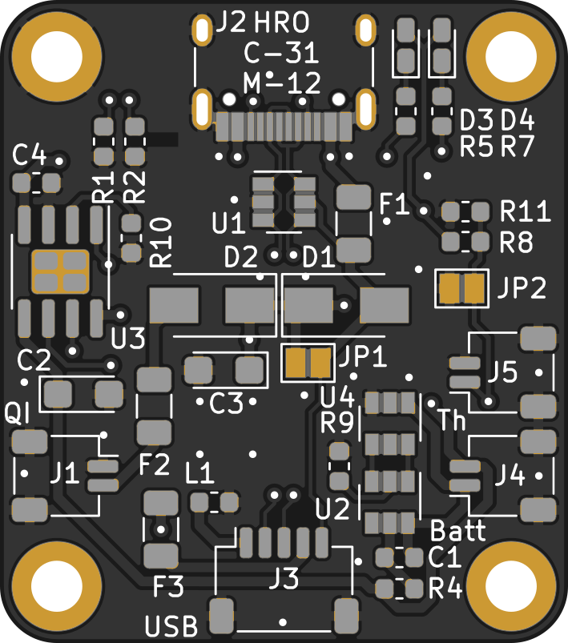

# Unified USB type-C PCB

## Changelog
* 22.11.2020: Simple PCB works, battery PCB is broken. Schematic has been fixed, PCB not. Fix will follow once I find time.
* 09.11.2022: Battery PCB should be fixed, but is untested - I applied the same modifications I previously bodge-wired to earlier protos. The simple PCB now also outputs 5V on the VBUS sense pin, allowing the ZMK Isometria to work with it. I also re-created production files since jlcpcb capabilities increased and they can now assemble everything on these boards. The project is mostly considered abandoned, as I moved to including all battery related circuitry on the main keyboard PCB by now. Still wanted to fix this old project of mine.

A collection of compatible USB-C (2.0) daughterboards with different capabilities, intended to be used in custom mechanical keyboards. All feature the same mechanical dimensions and mounting holes, as well as the same connector leading to the main keyboard PCB and can therefore be exchanged depending on the requeirements.

|||
|:----------------------------------------:|:----------------------------------------:|
|Simple PCB |Battery PCB|

### [Plain USB PCB](unified-usb-pcb_simple)
The simplest and cheapest of the three is just a plain USB breakout board, connecting a USB type C receptacle to a JST SH header for the main keyboard.
 * USB type C
 * SRV-05 TVS on the USB data lines for ESD protection
 * 5 pin JST SH header connecting to the main keyboard PCB

### [Li-Ion PCB](unified-usb-pcb_batt)
This PCB is intended for true wireless use of the keyboard, giving hours of autonomous operation (if a sufficiently large battery is chosen). The battery can be recharged either using the USB-C connector (which can also be used for data) or a QI receiver built into the keyboards base.
 * USB type C
 * JST SH 2-pin input for QI Receiver
 * SRV-05 TVS on the USB data lines for ESD protection
 * JST SH 2-pin header to connect a single Li-Ion or Li-Poly cell
 * TP4056 as a battery charger, DW01 for protection
 * A JST SH 2-pin header allows fo the use of a thermistor to measure cell temperature
 * A sense-wire allows the main controller to check if the battery is currently being charged
 * Solder jumpers to bridge the USB Schottky if no QI receiver is used, as well as the thermistor if the user chooses to use the battery without thermal protection
 * 5 pin JST SH header connecting to the main keyboard PCB
